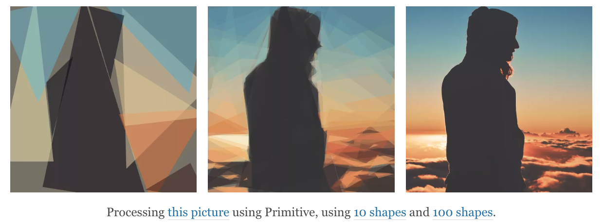

# Extra Transforms

##


## Traced SVG

[https://using-gatsby-image.gatsbyjs.org/traced-svg/](https://using-gatsby-image.gatsbyjs.org/traced-svg/)

<video controls="" style="max-width:100%" width="690" height="459"><source src="./assets/silhouette-lazy-loading_evq9xq.mp4" type="video/mp4"></video>

## Traced SVG: Install and Config

Included with gatsby-image

usage:

```js
query {
  image: file(relativePath: { eq: "gatsby-astronaut.png" }) {
    childImageSharp {
      fixed(width: 125, height: 125) {
        ...GatsbyImageSharpFixed_tracedSVG
      }
    }
  }
}
```

## SQIP

[https://github.com/gatsbyjs/gatsby/tree/master/packages/gatsby-transformer-sqip#readme](https://github.com/gatsbyjs/gatsby/tree/master/packages/gatsby-transformer-sqip#readme)



## SQIP: Install and Config

Run:

`yarn add gatsby-transformer-sharp`

and add `gatsby-transformer-sharp` it to your `gatsby-config.js`

## SQIP: Usage

```js
query {
  image: file(relativePath: { eq: "gatsby-astronaut.png" }) {
    sqip(numberOfPrimitives: 12, width: 125, height: 125) {
      dataURI
    }
    childImageSharp {
      fixed(width: 125, height: 125) {
        ...GatsbyImageSharpFixed
      }
    }
  }
}
```

```jsx

```
